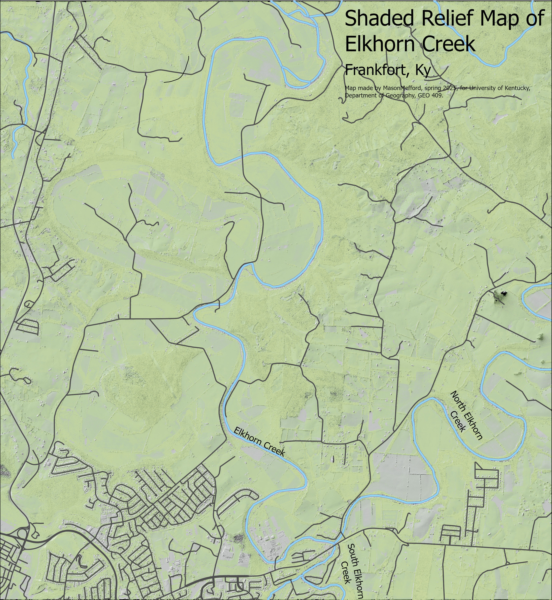

# Upper Stretch of Elkhorn Creek
## Frankfort, Ky

This stretch of Elkhorn Creek starts at the confluences of the North and South forks and contains fun and exciting floating opportunites for white water seekers!

     
*Shaded relief map of Elkhorn Creek*
     

Map made by MasonMefford, Spring 2025, for the University of Kentucky Department of Geogrpahy, GEO 409. Mad was made using data from KyFromAbove.gov and rendered on Blender